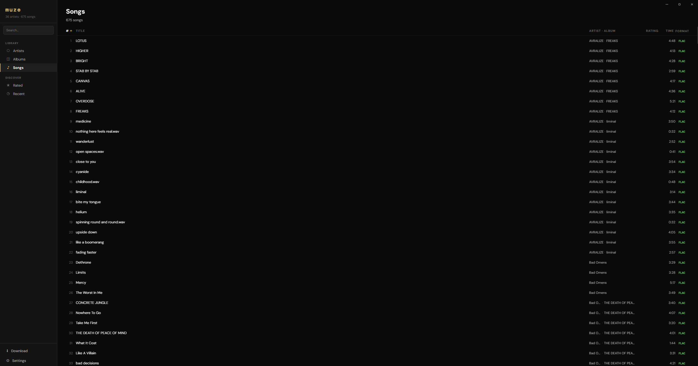
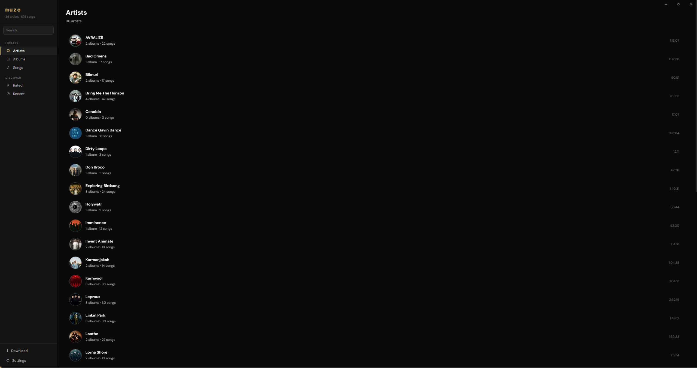
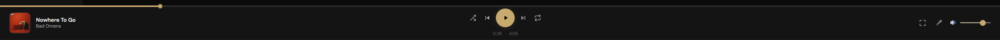
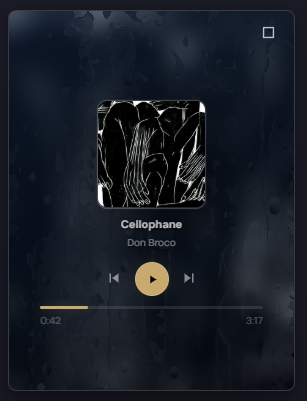
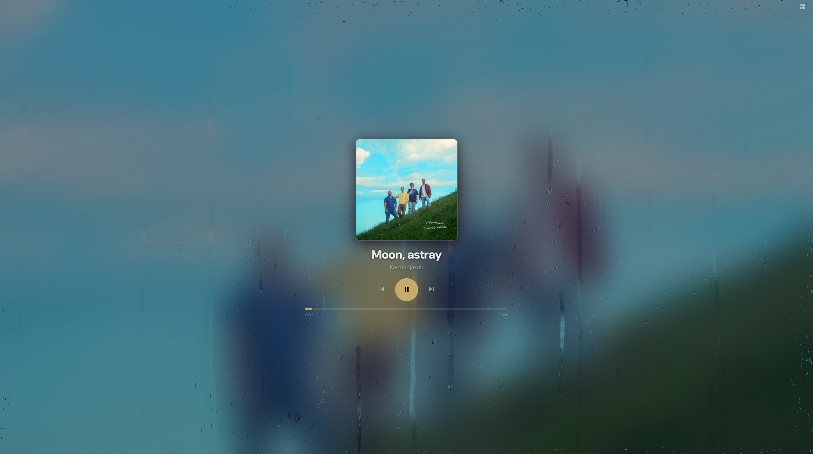
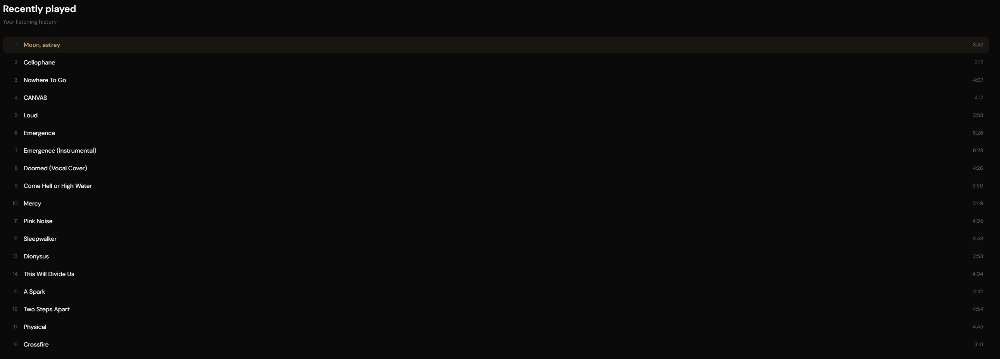
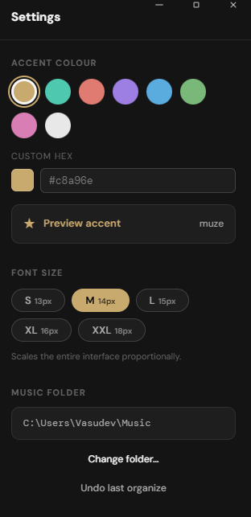

# Muze

Muze is a local-first desktop music player for Windows. It scans a music folder on your machine, builds an artist and album library, plays your files locally, and gives you a focused interface for browsing, rating, reviewing, and revisiting your collection.

The app is built with Electron, React, TypeScript, Howler, Zustand, and electron-vite.

## Features

### Library-first music browsing



Browse your collection by artist, album, song, rating, or recently played tracks. Muze reads your folder structure and audio metadata to build a clean local library without requiring a cloud account or streaming service.

### Artist and album views



Artists are grouped from folders inside your music directory. Albums use embedded metadata where available, and album covers are loaded from common image filenames such as `cover.jpg`, `folder.png`, `album.webp`, and similar files.

### Full playback controls



The bottom player bar includes playback, previous and next track controls, shuffle, repeat modes, volume, timeline scrubbing, and links back to the current artist or album.

### Mini player



When the window is resized small enough, Muze switches into a compact mini player with the same music controls, cover art, blurred artwork background, and animated rain-glass effect.

### Fullscreen rain player



The fullscreen player expands the mini player aesthetic across the whole display, using the current album or artist artwork as the basis for the background and rain effect.

### Ratings, reviews, and recent plays



Rate songs and albums, write short reviews, and return to recently played tracks. Muze stores ratings, reviews, play history, and play counts locally in your app data directory.

### Customization



Choose a music folder, rescan your library, change the accent color, and adjust the base font size from the settings panel.

## Music Folder Layout

Muze works best with a folder structure like this:

```text
Music/
  Artist Name/
    artist.jpg
    Album Name/
      cover.jpg
      01 - First Song.flac
      02 - Second Song.flac
    Another Album (2024)/
      folder.png
      01 - Track.mp3
    Loose Single.m4a
```

Supported audio extensions include:

```text
.mp3, .flac, .wav, .alac, .m4a, .aac, .ogg, .wma, .aiff, .ape, .opus
```

Supported artwork extensions include:

```text
.jpg, .jpeg, .png, .webp
```

Artist images are detected from names such as `artist`, `photo`, `profile`, `avatar`, or `folder` in the artist folder. Album covers are detected from names such as `cover`, `folder`, `album`, `artwork`, or `front` in the album folder.

Loose audio files placed directly inside an artist folder appear under an automatic `Singles & Loose Tracks` collection.

## Installation For Users

1. Download the latest Windows installer from the project's Releases page.
2. Run the Muze installer.
3. Launch Muze.
4. Select your music folder when prompted.
5. Let Muze scan your library.

After installation, your music stays on your computer. Muze reads local files and stores app data locally.

## Developer Setup

### Requirements

- Node.js 20 or newer
- npm
- Windows is the primary target for packaging

### Clone and install

```bash
git clone <repository-url>
cd muze
npm install
```

### Run in development

```bash
npm run dev
```

This starts the Electron development app through electron-vite.

### Build the app

```bash
npm run build
```

This compiles the Electron main process, preload script, and renderer into the `out/` directory.

### Create a Windows installer

```bash
npm run dist:win
```

Installer output is written to the `release/` directory.

## Scripts

| Command | Description |
| --- | --- |
| `npm run dev` | Start the Electron app in development mode. |
| `npm run build` | Build main, preload, and renderer output. |
| `npm run preview` | Preview the production build. |
| `npm run dist` | Build and package the app with electron-builder. |
| `npm run dist:win` | Build and create a Windows installer. |

## Project Structure

```text
src/
  main/          Electron main process, library scanner, local JSON database
  preload/       Safe IPC bridge exposed to the renderer
  renderer/      React UI, player state, library views, settings, styles
resources/       App icon and packaged resources
out/             Build output
release/         Installer output after packaging
```

## Local Data

Muze stores settings, ratings, reviews, and play history in Electron's app data directory for the current user. The music files themselves are not copied into the app; Muze keeps references to the files in your selected music folder.

## Notes

- Muze is currently designed as a local desktop app, not a streaming client.
- The app is dark-themed.
- Windows packaging is configured through `electron-builder`.
- If screenshots are added, place them under `docs/images/` and replace the placeholder paths above with the final image filenames.
